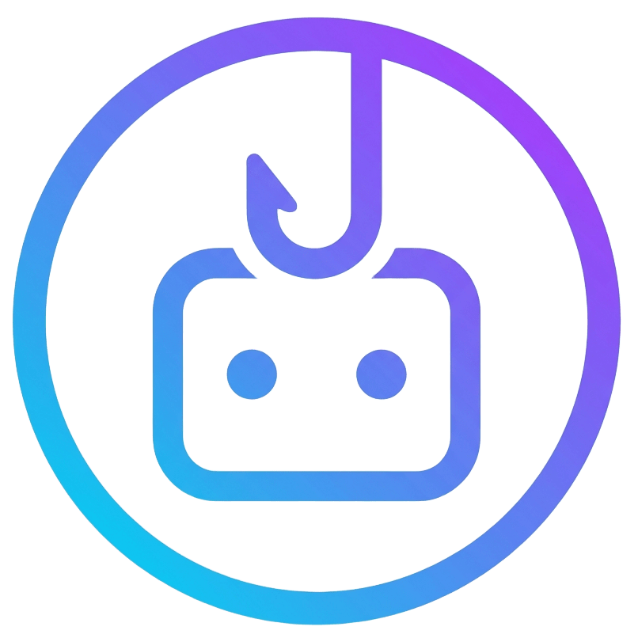
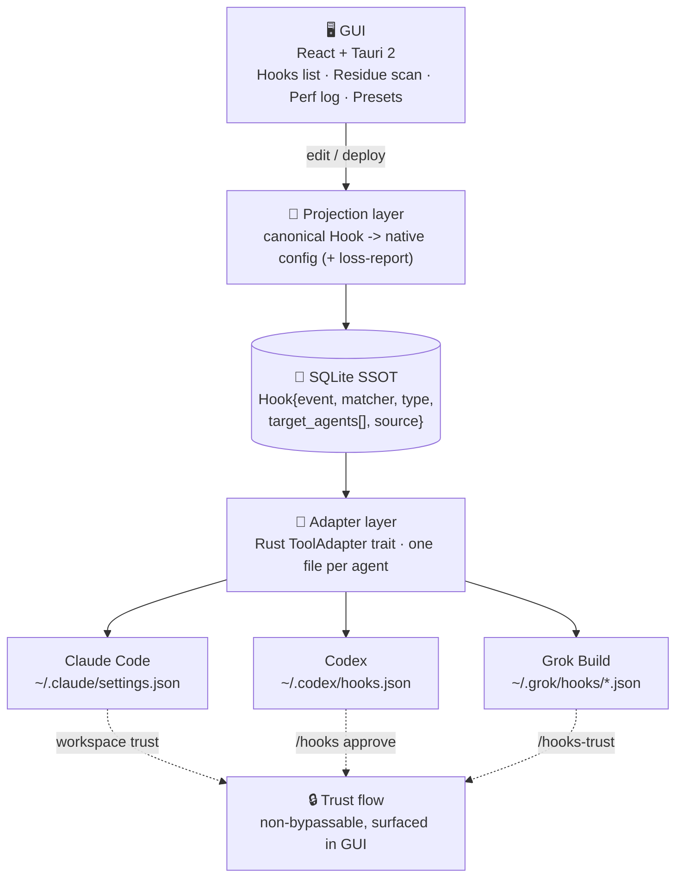

<p align="center">
  
</p>

# agent-hooks-manager

**The unified control panel for AI coding agent hooks.**

Keep hooks visible, portable, and clean across Claude Code, Codex, Grok Build, Gemini CLI, and Cursor — while each agent keeps running its own trust flow.

[](./LICENSE) [](./docs/roadmap.md) [](https://v2.tauri.app) [](#) [](./docs/architecture.md)

[Why](#why) · [How it works](#how-it-works) · [Supported agents](#supported-agents) · [Capabilities](#capabilities) · [Architecture](./docs/architecture.md) · [Roadmap](./docs/roadmap.md) · [简体中文](./README.zh-CN.md)

**把散落在各处的 agent hooks，收进一个可管理、可审计、可清理的统一面板。**

---

A desktop app and agent-agnostic hooks control plane. `agent-hooks-manager` keeps your hooks authorable from one place, projected into each agent's native config, and observable per execution. It does not replace your agent runtime — it manages the hooks layer above it.

**One hook, every agent. One panel, every hook.**

> See every hook. Trust each one. Clean the rest.

*Keywords: agent hooks manager · claude code hooks manager · codex hooks manager · grok build hooks · manage hooks across agents · clean up third-party hooks · remove hooks left by uninstalled tools · hooks out of control · too many hooks slow · claude code hooks GUI*

## Why

Every AI coding agent ships its own hook system — a different file, a different format (JSON/TOML), a different trust flow. Today that means:

- **Hooks are invisible.** No logs. Can't tell which hook is slow or looping until the session dies. ([anthropics/claude-code#44732](https://github.com/anthropics/claude-code/issues/44732))
- **Third-party tools leave hooks behind.** A plugin writes hooks into `~/.claude/settings.json` at install time; you uninstall the app, the hooks stay. ([#48100](https://github.com/anthropics/claude-code/issues/48100))
- **Configs multiply.** Hooks progressively duplicate until you have hundreds. ([#3523](https://github.com/anthropics/claude-code/issues/3523))
- **Death by a thousand hooks.** 100+ hooks add seconds of overhead per tool call. ([dawidgac](https://dawidgac.com/en/blog/claude-code-hooks-optimization))
- **No management UI, no hot-reload.** Everything is hand-edited JSON. ([#36121](https://github.com/anthropics/claude-code/issues/36121))

The slow rot looks like this:

```text
install plugin   ──▶  writes hooks into ~/.claude/settings.json
uninstall app     ──▶  hooks stay (orphaned, still firing)
next session      ──▶  100+ hooks fire on every tool call
                   ──▶  seconds of overhead · silent loops · no logs
```

No existing tool unifies hooks across agents with a GUI, residue cleanup, and observability — this fills that gap.

## How it works



A useful mental model: a **projection-based hooks SSOT**. You author one canonical `Hook`; the projection layer writes each agent's native file and reports anything it could not translate. SQLite stays the source of truth; agent configs are a projection, never the other way around.

Full design: [`docs/architecture.md`](./docs/architecture.md). Add an agent: [`docs/adapters.md`](./docs/adapters.md).

## Supported agents

| Agent | Hook location | Format | Trust flow |
| --- | --- | --- | --- |
| Claude Code | `~/.claude/settings.json` | JSON | Workspace trust (hot-swap, no restart) |
| Codex | `~/.codex/hooks.json` | JSON | `/hooks` manual approve (hash trust) |
| Grok Build | `~/.grok/hooks/*.json` | JSON | `/hooks-trust` |
| Gemini CLI | `~/.gemini/settings.json` | JSON | Settings trust *(P1)* |
| Cursor | `~/.cursor/...` | JSON | Settings trust *(P1)* |

Adding an agent is one file — implement the `ToolAdapter` trait and register it. See [`docs/adapters.md`](./docs/adapters.md).

## Capabilities

`agent-hooks-manager` folds hook management into five questions:

| Question | What it keeps visible |
| --- | --- |
| Which hooks are active? | One list across every agent, scope, and project. |
| Where did this hook come from? | Source tracking: yours · third-party · orphaned. |
| Is a hook slow or looping? | Per-hook execution log · p95 latency · loop detection. |
| Can I deploy one hook everywhere? | Author once → project to each target agent's native format. |
| What did uninstalled tools leave behind? | Residue scanner across user / project / local scopes. |

### Management surface

| Surface | What it does | Start with |
| --- | --- | --- |
| Hooks list | Author, edit, enable/disable, and deploy hooks across agents. | the Hooks tab |
| Residue scanner | Find third-party / orphaned hooks and remove them across scopes. | Scan → review → one-click remove |
| Performance log | Per-hook execution log, p95 latency, loop detection. | the Perf tab |
| Presets | One-click installable hook bundles for common workflows. | [`resources/presets/`](./resources/README.md) |
| Projection layer | Canonical `Hook` → native config (+ loss report). | [`docs/architecture.md`](./docs/architecture.md) |

## Try it

> Pre-alpha scaffold — **not runnable yet.** The commands below show the intended flow once the first build ships. Track progress in [`docs/roadmap.md`](./docs/roadmap.md).

```bash
# planned
npm install
npm run tauri dev      # launch the desktop app
```

Then in the app: **scan** existing hooks → review **residue** → **author** a hook → pick **target agents** → **deploy**. The GUI surfaces each agent's trust step instead of pretending one click is enough.

## Documentation

Start with the path that matches your role.

### Use and operate

- [Roadmap](./docs/roadmap.md): what ships in P0 / P1 / P2.
- [Presets](./resources/README.md): reusable, one-click hook bundles.

### Understand the design

- [Architecture](./docs/architecture.md): SSOT, projection layer, adapter layer.
- [Adapters](./docs/adapters.md): how to add a new agent in five steps.

### Contribute

- [AGENTS.md](./AGENTS.md): conventions for agents and contributors working in this repo.

## Community and feedback

Still early. The most useful feedback is real: which agent's hooks were hardest to manage, which residue you couldn't clean, which hook was silently looping.

- Use [GitHub Issues](https://github.com/XuChen-AI/Agent-Hooks-Manager/issues) for reproducible bugs, install problems, and feature requests.
- Open PRs for new adapters, presets, and docs fixes.

## Current status

Pre-alpha scaffold. Not runnable yet. The state and projection contracts are the design center; the GUI, residue scanner, and performance log are being built on top of them. See [`docs/roadmap.md`](./docs/roadmap.md).

`agent-hooks-manager` does not bypass any agent's trust flow. Workspace trust, hook approval, dangerous permissions, and final ownership stay with the human and the agent — the app only makes them visible.

## Tech stack

Tauri 2 · Rust · React 19 · TypeScript · SQLite · TailwindCSS

## License

MIT. See [LICENSE](./LICENSE).
