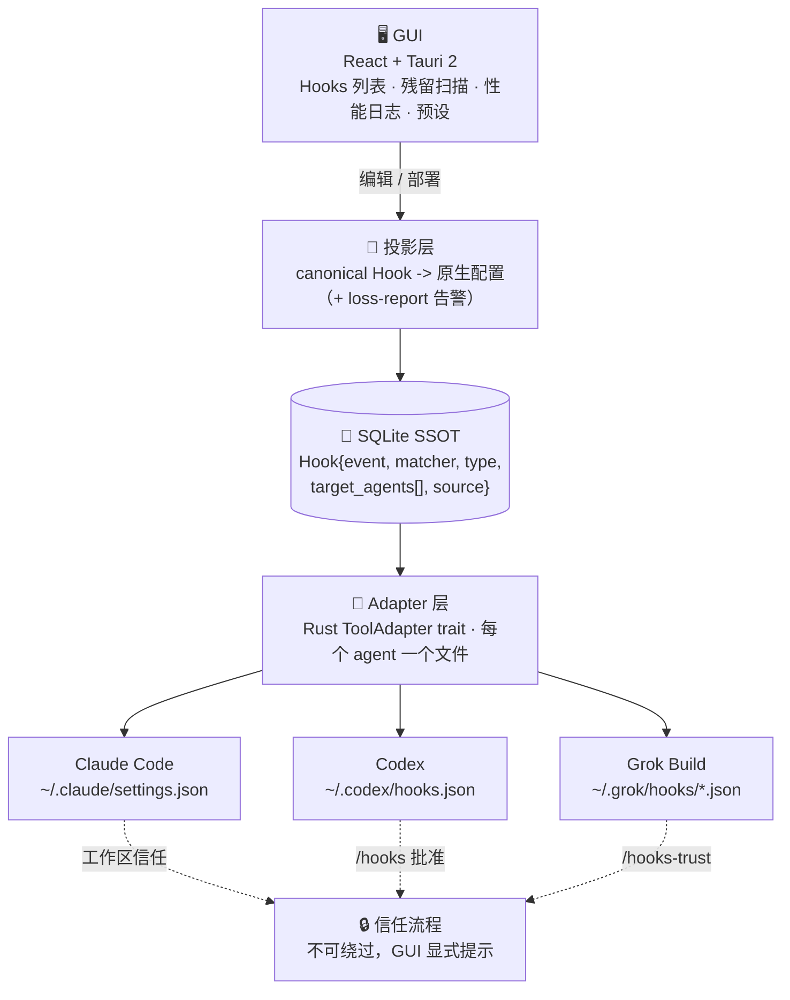

<p align="center">
  
</p>

# agent-hooks-manager

**AI 编码 agent 的统一 hooks 控制面板。**

让 Claude Code、Codex、Grok Build、Gemini CLI、Cursor 的 hooks 集中可见、可移植、可清理--每个 agent 照旧跑自己的信任流程。

[](./LICENSE) [](./docs/roadmap.md) [](https://v2.tauri.app) [](#) [](./docs/architecture.md)

[为什么做](#为什么做) · [怎么工作](#怎么工作) · [支持的 agent](#支持的-agent) · [能力](#能力) · [架构](./docs/architecture.md) · [路线图](./docs/roadmap.md) · [English](./README.md)

**把散落在各处的 agent hooks，收进一个可管理、可审计、可清理的统一面板。**

---

一个桌面应用 + agent 无关的 hooks 控制平面。`agent-hooks-manager` 让你在一个地方编写 hooks，投影成各 agent 的原生配置，并按每次执行做可观测。它不替代你的 agent 运行时--只管它上面的 hooks 层。

**一次编写，处处部署；一块面板，全部 hooks。**

> 看见每一个 hook。信任每一个 hook。清掉其余的。

*搜索关键词：agent hooks manager · claude code hooks 管理 · codex hooks 管理 · grok build hooks · 跨 agent 管理 hooks · 统一 hooks 管理 · 清理第三方 hooks · 删除卸载残留 hooks · hooks 太多变慢 · hooks 失控 · claude code hooks 图形界面*

## 为什么做

每个 AI 编码 agent 都自带一套 hooks 系统--配置位置不同、格式不同（JSON/TOML）、信任流程也不同。于是今天你会遇到：

- **hooks 不可见。** 没日志，不知道哪个慢、哪个在死循环，直到会话挂掉。([anthropics/claude-code#44732](https://github.com/anthropics/claude-code/issues/44732))
- **第三方工具留残。** 插件安装时往 `~/.claude/settings.json` 塞 hooks，卸载了 app，hooks 还在。([#48100](https://github.com/anthropics/claude-code/issues/48100))
- **配置会增殖。** hooks 不断复制，能攒到几百个。([#3523](https://github.com/anthropics/claude-code/issues/3523))
- **千 hook 杀性能。** 100+ 个 hook 每次工具调用加数秒开销。([dawidgac](https://dawidgac.com/en/blog/claude-code-hooks-optimization))
- **没管理界面、没热重载。** 全靠手改 JSON。([#36121](https://github.com/anthropics/claude-code/issues/36121))

缓慢腐烂的过程长这样：

```text
装插件           ──▶  往 ~/.claude/settings.json 写 hooks
卸载 app         ──▶  hooks 留下（成孤儿，照样触发）
下一次会话       ──▶  100+ 个 hook 每次工具调用都跑
                  ──▶  数秒开销 · 静默死循环 · 没日志
```

目前没有工具把「跨 agent + GUI + 残留清理 + 可观测」统一起来--本项目补这个空。

## 怎么工作



一个好用的心智模型：**基于投影的 hooks 单一事实源（SSOT）**。你只写一个 canonical `Hook`，投影层把它写成各 agent 的原生文件，并报告哪些没法翻译。SQLite 始终是事实源；agent 配置只是投影，绝不会反过来。

完整设计：[`docs/architecture.md`](./docs/architecture.md)。加 agent：[`docs/adapters.md`](./docs/adapters.md)。

## 支持的 agent

| Agent | Hook 位置 | 格式 | 信任流程 |
| --- | --- | --- | --- |
| Claude Code | `~/.claude/settings.json` | JSON | 工作区信任（热切换，免重启） |
| Codex | `~/.codex/hooks.json` | JSON | `/hooks` 手动批准（哈希信任） |
| Grok Build | `~/.grok/hooks/*.json` | JSON | `/hooks-trust` |
| Gemini CLI | `~/.gemini/settings.json` | JSON | 配置信任 *(P1)* |
| Cursor | `~/.cursor/...` | JSON | 配置信任 *(P1)* |

加一个 agent 只需一个文件--实现 `ToolAdapter` trait 并注册。见 [`docs/adapters.md`](./docs/adapters.md)。

## 能力

`agent-hooks-manager` 把 hooks 管理折叠成五个问题：

| 问题 | 它让你看见什么 |
| --- | --- |
| 哪些 hook 在生效？ | 跨所有 agent、scope、项目的统一列表。 |
| 这个 hook 哪来的？ | 来源追踪：你的 · 第三方 · 孤儿。 |
| 哪个 hook 慢或在死循环？ | 每个 hook 的执行日志 · p95 延迟 · 循环检测。 |
| 能把一个 hook 部署到所有 agent 吗？ | 写一次 -> 投影成各目标 agent 的原生格式。 |
| 卸载的工具留了什么？ | 跨 user / project / local scope 的残留扫描器。 |

### 管理面板

| 面板 | 做什么 | 从哪进 |
| --- | --- | --- |
| Hooks 列表 | 跨 agent 编写、编辑、启停、部署 hooks。 | Hooks 标签页 |
| 残留扫描器 | 找出第三方 / 孤儿 hooks，跨 scope 移除。 | 扫描 -> 审查 -> 一键移除 |
| 性能日志 | 每个 hook 的执行日志、p95 延迟、循环检测。 | Perf 标签页 |
| 预设 | 常用工作流的一键 hook 套装。 | [`resources/presets/`](./resources/README.md) |
| 投影层 | canonical `Hook` -> 原生配置（+ 丢失报告）。 | [`docs/architecture.md`](./docs/architecture.md) |

## 试一下

> Pre-alpha 脚手架--**尚不可运行**。下面的命令是首个构建发布后的预期流程。进度见 [`docs/roadmap.md`](./docs/roadmap.md)。

```bash
# 计划中
npm install
npm run tauri dev      # 启动桌面应用
```

然后在应用里：**扫描**已有 hooks -> 审查**残留** -> **编写**一个 hook -> 勾选**目标 agent** -> **部署**。GUI 会显式提示每个 agent 的信任步骤，而不是假装一键搞定。

## 文档

按你的角色选一个入口。

### 使用与运维

- [路线图](./docs/roadmap.md)：P0 / P1 / P2 各做什么。
- [预设](./resources/README.md)：可一键安装的 hook 套装。

### 理解设计

- [架构](./docs/architecture.md)：SSOT、投影层、adapter 层。
- [Adapter](./docs/adapters.md)：五步加一个新 agent。

### 贡献

- [AGENTS.md](./AGENTS.md)：在本仓库工作的 agent 与贡献者约定。

## 社区与反馈

项目还很早。最有用的反馈来自真实场景：哪个 agent 的 hooks 最难管、哪些残留清不掉、哪个 hook 在静默死循环。

- 用 [GitHub Issues](https://github.com/XuChen-AI/Agent-Hooks-Manager/issues) 提可复现的 bug、安装问题和功能请求。
- 欢迎提 PR：新 adapter、新预设、文档修正。

## 当前状态

Pre-alpha 脚手架，尚不可运行。状态与投影契约是设计中心；GUI、残留扫描器、性能日志都在其上搭建。见 [`docs/roadmap.md`](./docs/roadmap.md)。

`agent-hooks-manager` 不绕过任何 agent 的信任流程。工作区信任、hook 批准、危险权限和最终所有权都留给人和 agent--本应用只让它们变得可见。

## 技术栈

Tauri 2 · Rust · React 19 · TypeScript · SQLite · TailwindCSS

## 协议

MIT。见 [LICENSE](./LICENSE)。
